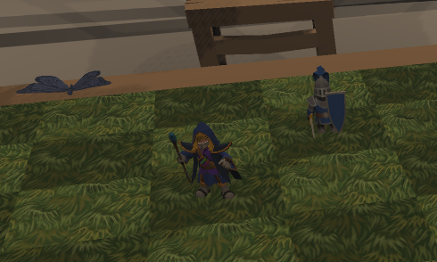
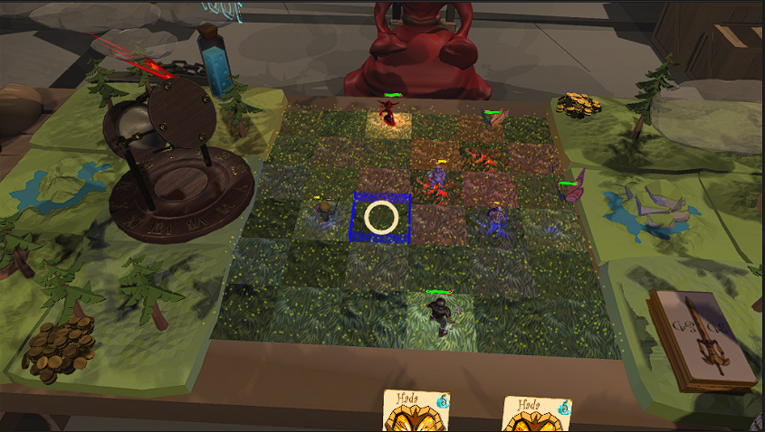

# 3D&D

## Description
### __Genre:__
Card PvP RPG

### __Story/Narrative:__ 
You're a casual D&D player, in a basement, ready to challenge your friends. The game is about evil versus good. Humans versus demons and creatures.

### __Characters:__
The game is mainly multiplayer focus and has no story characters.

The 2 main characters of the game are both the players, one will be the "good" character, the blue knight, while the other one will be "evil" character, the red mage.

### __World/Levels:__
A table decorated with a medieval style in a basement of similar theme for you to play.

### __Gameplay/Mechanics:__

This is a pvp game, therefore the gameplay is focused around multiplayer fighting in an arena, where both players will be able to summon creatures and use them to defeat their opponent.
#### __Board__ 
This arena will be a board with pieces and other decoration. 

The board will be divided into tiles, where each piece can be placed.

#### __Summoning monsters__
The different pieces will be summoned from cards, each player will have it´s own deck of cards.

#### __Board Arena__ 
The different pieces will have their own cards, either for attacking, moving or special abilities.

#### __Mana__ 
Every card will have its own mana cost, which will be spend from the player´s pool, which will renew each turn.

#### __End of game__ 
The objective of the game its to depleat the enemies health bar, each player has its own commander, the only unit which can summon other units.

### __Audionarrator/dialoguetree:__

We won´t use dialogues or audionarration in the game.

### __UserInterface(UI):__

The user interface will consist of a pair of 2 hands, which the player can use to interact with the different cards or pieces in the board if using oculus quest 2,
the player could also use a cardboard vr or a bluetooth gamepad aswell.

The player will be able to select the different pieces on the board, both enemies and allies to check their skills, and also select the cards in their hand to see
it´s details.

    Button A: Confirm
    Button B: Cancel / Back
    Button X: Quick Change
    Button Y: t (Only Oculus)

    Button Start: Pause Menu
    Button Select: Show / Hide Card Info
    Joystick Right: Rotate Table ?
    Joystick Left: Move between cards and existing pieces on the table.

    DPad Up: Joystick Left equivalent.
    DPad Down: Joystick Left equivalent.
    DPad Left: Joystick Left equivalent.
    DPad Right: Joystick Left equivalent.
    
    Rigth Bumper: -
    Right Trigger: t (Oculus Only)
    Left Bumper: -
    Left Trigger: -

### __Wish-list:__

Personal models: we are planning to use free models from the unity store, but it would be great to get our own models for the game.

Animations: add animations to the models we would make.

Music and sound effects: getting music and sound effects that fit the game theme.

Solo mode: if we have time left after finishing the multiplayer, we would like to made some kind of story or solo mode where the players can play against the AI.

## __Game development planning__
### __Kanban__
The development planning will be structured around a Kanban. 

We will create an item inside the kanban for each functionality. 

#### __New__
In the new section, we will place functionalities we have not decided yet. Functionalities that must be debated and discussed before including them.
#### __Backlog__
Inside the backlog we will place well thought and already discussed functionalities. The ones that will be implemented.
#### __Ready__
Ready will store refined functionalities. So it can be worked on by a single individual. 
#### __In progress__
This container will store functionalities that is actually being worked on and there is a person asigned to it.
#### __In review__
Once the functionality is finished, the item will go here. It will be awaiting the approval of the rest of the team.
#### __Done__
Here will be stored the functionalities that are completed and there is nothing to be improved on anymore. 

___Note:___ It is possible that more than one person can be assigned to a single functionality.

## Sprint 2

### World

We have built the room where the game is going to be played based on the rooms where D&D is played.

The board will be placed in the middle of the table.

### Characters

We have designed the cards of some of the characters. This cards will have the name, life and damage of the characters.

We are also modelling some of the main characters in Blender.

For the rest of the characters, we will download them from the asset store. The characters will be animated with an idle, walk and attack animations.

### Gameplay

For the management of the hand of cards we made some scripts that let the player select and cycle through the hand. The player can also place the cards on the board.

## Sprint 3

We added a game menu.

We have completed the board and his funcionalities.

### Characters

We have added most of the characters into the game with its corresponding animations.

We have added sound effects to the different characters of the game.

### Gameplay

The player can summon the different creatures using the cards in his hand.

We have added a mana system that will be used for the summoning of the creatures.

The player can move the creatures and attack with them.

# Alpha Release

We have finally arrived to Alpha release, but sadly we haven´t been able to create the multiplayer experience we hoped for, mainly because Unity´s multiplayer support is very limited, but the game is still playable and we have achieved most of the funcionalities we wanted in our game.

## Controls

To navigate throught the menu we need to use a controller connected to our phone, but during the match we will use gaze-input to move through the table, summon creatures, select cards, etc... To simulate a click or an interaction, the user must look to an object for exactly 1.5 seconds.

## Walk-through

The first screen you will see when you start the game will be something like this:

This is the main menu, from here you will be able to start a game or quit and do something else.

If you are brave enough and decided to click play, then you will be able to see the select game screen:

From this screen you will be able to select a game that is already created and join it, or create your own. (As we have discussed before, online funcionalities are not working, so no matter which one of the options you choose, you will join the same match.)

When you join the match you will see something like this:

This is your first hand, as you can see it consists of 3 cards, in this case you have 2 dogs and 1 skeleton, your objective is using this cards to destroy the main commander unit, the one that starts already on the field.

You also have a commander unit in the side of your field, and your objective should be to protect him at all costs, but he can also attack and defend.

Lets summon a unit and see how everything works:

You have summoned the dog, good choice, he is a very strong card and because of that power he is very expensive to summon, as you can see your whole mana bar has been depleted:

But don't worry, this is the end of your turn, so if you look at the hourglass to your left, your turn will end and the demonic mage will start its attack!

If you had enough mana, you could move or attack, move costs 10 mana while attack costs 20 mana, to do either of those you had to select their respective cards:

Now is your oponents turn, and he decided to summon a troll, he is a very dangerous unit.

You can use your dog to move in close and attack.

Be careful though, the troll is hitting you back!

Devise a strategy to defeat the enemy´s commander and win the game!

## Card Showcase

### __Guerrero__

- Hit Points: 5
- Attack Damage: 3
- Mana Cost: 40
- Movement Range: 2 
- Minimum Attack Range: 1  
- Maximum Attack Range: 2

### __Perro__

- Hit Points: 10
- Attack Damage: 6
- Mana Cost: 100
- Movement Range: 3
- Minimum Attack Range: 2
- Maximum Attack Range: 3

### __Mago__

- Hit Points: 3
- Attack Damage: 4
- Mana Cost: 40
- Movement Range: 2
- Minimum Attack Range: 2
- Maximum Attack Range: 3

### __Hada__

- Hit Points: 3
- Attack Damage: 1
- Mana Cost: 5
- Movement Range: 30
- Minimum Attack Range: 1
- Maximum Attack Range: 1

### __Esqueleto__

- Hit Points: 2
- Attack Damage: 2
- Mana Cost: 30
- Movement Range: 2
- Minimum Attack Range: 1
- Maximum Attack Range: 2

### __Troll__

- Hit Points: 15
- Attack Damage: 2
- Mana Cost: 60
- Movement Range: 2
- Minimum Attack Range: 1
- Maximum Attack Range: 3

# Game credits

## Team members

### __Pablo Alonso Alonso UO277931__

- Scripting.
- Card game logic.
- Funcionality logic.
- Character lighting.
- Documentation.

### __Valentin Dumitru UO277867__

- Team leader.
- Scripting.
- Card Design.
- Animations.
- Enviroment Design.
- Art.

### __Guillermo de Leiva Martínez UO246355__

- Sound Design.
- Animations.
- Initial Game Concept Idea.
- Documentation.
- Sounds and effects.

### __Álvaro García Peña UO275778__

- Scripting.
- Enviroment Design.
- Animations.
- Sounds and effects.
- Online research.

  
### __Damir Abdrafikov UO277306__

- Scripting.
- Funcionality logic.
- Character logic.
- Online research.
- Board logic.

## Video & APK

[Video and APK](https://unioviedo-my.sharepoint.com/personal/uo277931_uniovi_es/_layouts/15/onedrive.aspx?id=%2Fpersonal%2Fuo277931_uniovi_es%2FDocuments%2F4%2FRAA%2FTrabajo%20grupal&ct=1672951928917&or=Teams-HL&ga=1)