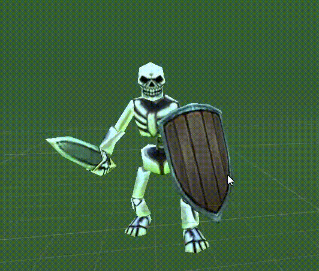

# 3D&D
## Description
### __Genre:__
Card PvP RPG

### __Story/Narrative:__ 
You're a casual D&D player in a basement challenging your friends. The game is about evil versus good. Humans versus demons and creatures.

### __Characters:__
The game is multiplater mainly and has no story characters.

The 2 main characters of the game are each players, one will be the "good" character while the other one will be "evil".

### __World/Levels:__
A medieval decorated table in a basement for you to play.

### __Gameplay/Mechanics:__

This is a pvp game, therefore the gameplay is focused around multiplayer fighting in an arena. 
#### __Board__ 
This arena will be a board with pieces and other decoration. 

The board will be divided into tiles, where each piece can be placed.

#### __Summoning monsters__
The different pieces will be summoned from cards, each player will have it´s own deck of cards.

#### __Board Arena__ 
The different pieces will have their own cards, either for attacking, moving or special abilities.

#### __Mana__ 
Every card will have its own mana cost, which will be spend from the player´s pool, which will renew each turn.

#### __End of game__ 
The objective of the game its to depleat the enemies health bar, each player has its own commander, the only unit which can summon other units.

### __Audionarrator/dialoguetree:__

We won´t use dialogues or audionarration in the game.

### __UserInterface(UI):__

The user interface will consist of a pair of 2 hands, which the player can use to interact with the different cards or pieces in the board if using oculus quest 2,
the player could also use a cardboard vr or a bluetooth gamepad aswell.

The player will be able to select the different pieces on the board, both enemies and allies to check their skills, and also select the cards in their hand to see
it´s details.

    Button A: Confirm
    Button B: Cancel / Back
    Button X: Quick Change
    Button Y: t (Only Oculus)

    Button Start: Pause Menu
    Button Select: Show / Hide Card Info
    Joystick Right: Rotate Table ?
    Joystick Left: Move between cards and existing pieces on the table.

    DPad Up: Joystick Left equivalent.
    DPad Down: Joystick Left equivalent.
    DPad Left: Joystick Left equivalent.
    DPad Right: Joystick Left equivalent.
    
    Rigth Bumper: -
    Right Trigger: t (Oculus Only)
    Left Bumper: -
    Left Trigger: -

### __Wish-list:__

Personal models: we are planning to use free models from the unity store, but it would be great to get our own models for the game.

Animations: add animations to the models we would make.

Music and sound effects: getting music and sound effects that fit the game theme.

Solo mode: if we have time left after finishing the multiplayer, we would like to made some kind of story or solo mode where the players can play against the AI.

## __Game development planning__
### __Kanban__
The development planning will be structured around a Kanban. 

We will create an item inside the kanban for each functionality. 

#### __New__
In the new section, we will place yet not decided functionalities. Functionalities that must be debated and decided before including definitely.
#### __Backlog__
Inside the backlog we will place well thought functionalities. The ones that will be implemented.
#### __Ready__
Ready will store refined functionalities. So it can be worked on by a single individual. 
#### __In progress__
This container will store functionalities that is actually being worked on and there is a person asigned to it.
#### __In review__
Once the functionality is finished, the item will go here. It will be awaiting the approval of the rest of the team.
#### __Done__
Here will be stored the functionalities that are approved and there is nothing to be worked on anymore. 

___Note:___ It is possible that more than one person can be assigned to a single functionality.

## Sprint 2

### World

We have built the room where the game is going to be played based on the rooms where D&D is played.

The board will be placed in the middle of the table.
<!-- Añadir imagen del tablero con personajes en la mesa -->

### Characters

We have designed the cards of some of the characters. This cards will have the name, life and damage of the characters.

We are also modelling some of the main characters in Blender.

<!-- Añadir modelos Valentín -->

For the rest of the character we will download them from the asset store. We will animate the characters so they will have an idle and an attack animations.

### Gameplay

For the management of the hand of cards we made some scripts that let the player select cards and cycle through the hand. The player can also place the cards on the board.

